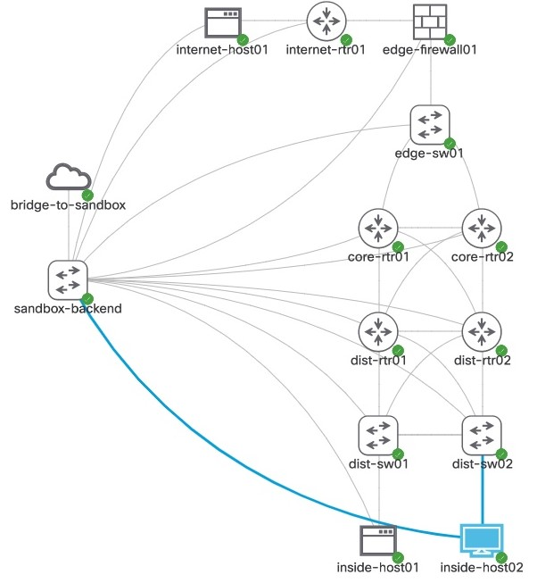
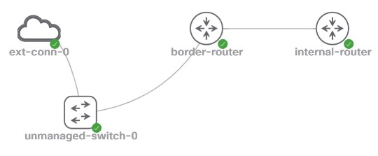
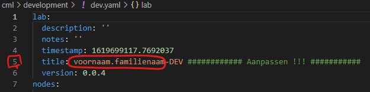
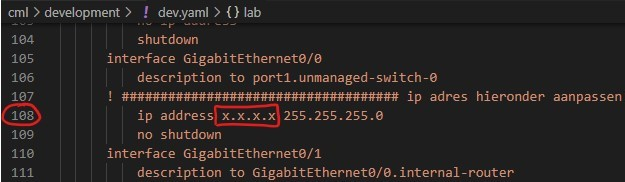
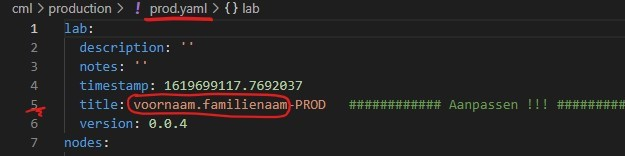
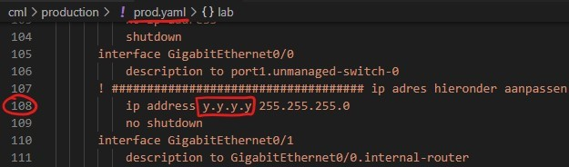

:numbered:
:toc:
:icons: font
:experimental:

= Opgave: Infrastructure as Code -- CI/CD
Roel Van Steenberghe <roel.vansteenberghe@odisee.be>; Sven Knockaert <Sven.Knockaert@odisee.be>

== Voorbereiding

Ter info: Deze opgave wordt individueel afgewerkt... 

== Leerdoelen

* Begrip van het concept CI/CD
* Opzetten van CI/CD adhv Gitlab en Gitlab-runners
* Introductie in de 'devops'-filosofie
* Automatiseren van netwerkconfiguratie aan de hand van Cisco Modeling Labs

== Opgave

=== Opzet

Bij deze opgave zullen jullie een continuous integration / continuous deployment pipeline opzetten. 

Het scenario waarin we werken is dat van een bedrijf waar veel mensen verantwoordelijk zijn voor de uitrol en het onderhouden van het bedrijfskritische netwerk. 

Omdat, bij het configureren van aanpassingen, een kleine fout grote gevolgen kan hebben, wordt geopteerd om een aantal  testen uit te voeren vooraleer de netwerkconfiguratie naar productie wordt overgezet.

Om onze netwerkomgeving aan testen te kunnen onderwerpen maken we gebruik van CML (Cisco Modeling Labs), een geavanceerde netwerksimulator waarin we ons netwerk (of onderdelen daarvan) kunnen nabouwen (voorbeeld hieronder).

NOTE: In dit labo zullen zowel de testomgeving als de productieomgeving van het netwerk in CML gesimuleerd worden aangezien we geen toegang hebben tot fysieke apparatuur.

Het doel is om bij elke geplande wijziging in het netwerk eerst een virtuele netwerkomgeving op te zetten `(development)` waarbij het configureren gebeurt samen met enkele testen vooraleer de afgewerkte configuratie beschikbaar wordt gesteld aan de mensen die de effectieve deploys doen `(deployment)`.

WARNING: Je ziet dat we hier zowel de Continuous Integration (CI), samen met het testen, als de Continuous Deployment (CD) voorzien. Het zal in deze labo-opgave echter wel een manuele interventie vergen om de Continuous Deployment (CD) te starten. Dit kan uiteraard ook prima geautomatiseerd worden maar wordt hier als optioneel beschouwd.

*Samengevat* kan je stellen dat we in deze opgave een team zullen hebben dat in een #development branch# de nodige aanpassingen zal doorvoeren en testen op een *development-omgeving*. Als resultaat stellen ze een configuratie-bestand (running-config) van de toestellen ter beschikking. +
Een ander team kan dan instaan voor de effectieve deployment naar de *productie-omgeving* door het configuratie-bestand op te nemen in de #master branch#. +
In beide gevallen start bij het `pushen` naar hun branch (master of development) automatisch een pipeline die de respectievelijke opdrachten (jobs) voor beide teams uitvoert.

Het is *jullie taak* in deze labo-opdracht om de pipelines voor deze beide teams op te bouwen!

De *topologie* die wij gebruiken *in deze opgave*  is vrij eenvoudig:

=== Over CML (Cisco Modeling Labs)

CML is een test- en simulatie omgeving van Cisco waarin echte images van routers, switches, firewalls, Linux-vm's,... kunnen gebruikt worden.
Met deze simulaties kunnen reële scenarios nagebouwd worden van bv. je productie-omgeving.
CML is dan ook de ideale omgeving om gebruikt te worden in een CI/CD proces waarbij bv. de test-fase kan uitgevoerd worden op dergelijk gesimuleerde routers en switches.

Je kan CML via een grafische webinterface benaderen om daar via de GUI een topologie uit te tekenen en toestellen virtueel te bekabelen.
Uiteraard is dit in een automatisatie-flow niet handig en dus kunnen we die topologie ook definiëren in een `YAML-gebaseerd` tekstbestand, bijvoorbeeld met de naam topology.yaml. +
In dit bestand kan dan ook de "startup-config" opgenomen worden zoals je die kent van het Cisco-curriculum.

CML op een geautomatiseerde manier benaderen kan op verschillende manieren via bv. API's (bv. python script,...), maar wij gebruiken daarvoor een python gebaseerde wrapper met de naam "cmlutils" (link:https://developer.cisco.com/codeexchange/github/repo/CiscoDevNet/virlutils/[meer info]).
cmlutils kan een "simulatie" op de CML server starten of stoppen. Dit kan eenvoudigweg met "cml up" of "cml down".

NOTE: in de documentatie zal je nog heel dikwijls "virl" zien verschijnen. Dit was de naam van de vorige versie van CML maar onderliggend wordt deze terminologie nog dikwijls gebruikt.

Onze "CML"-server is te vinden op: (link:https://tinyurl.com/yh8ez83o[zie overzicht per student]). +
Zowel de webinterface als de cmlutils gebruiken dezelfde credentials.

* username: admin
* password: Azerty123@

CAUTION: Je hoeft eigenlijk enkel aan te melden op het webplatform om even een kijkje te nemen of je deployment goed gelukt is of om eventueel je deployment te verwijderen (al kan dit in principe allemaal vanuit cmlutils).

=== Development flow

We streven ernaar om een git flow op te zetten die bij elke push naar de *development* branch een pipeline opstart. Die pipeline zal de configuratie (zie verder) doorvoeren en een aantal testen uitvoeren. Enkel bij het slagen van de tests wordt de nieuwe configuratiefile (running-config.cfg) voor de router vrijgegeven in een downloadbaar artefact.
Zo weten de netwerkingenieurs op elk moment waar ze de laatste nieuw geteste versie van de router-config kunnen vinden om te gaan deployen. De specfieke configuratie van de router in deze development fase zal gebeuren via Ansible.

In een volgende stap kan (bv. een ander team netwerkingenieurs) men de beschikbaar gemaakte router-config kopiëren en pushen naar de master branch. Dit moet op zijn beurt een pipeline starten die de config onmiddellijk toepast op de productie-infrastructuur..

Developers (ingenieurs) die hun feature-branch (development) aanpassen maar niet slagen in de testen moeten terug naar de tekentafel en de config aanpassen waar nodig. Zo vermijden we dat niet werkende configs hun weg vinden naar de productie-omgeving.

=== Uitvoering

Gelukkig moet je niet van nul starten. Het netwerkdepartement gaf al een deel van de manuele procedure voor deze pipelines vrij, en bezorgde ons de documentatie daarvoor. Je vindt die informatie (een basis-structuur en enkele bestanden) ook in deze repository.

Aan jullie vragen we om dit verder uit te bouwen en te gaan automatiseren.

Gebruik daarvoor de ingebouwde CI-functionaliteit in Gitlab.

==== Git Repo

Zorg eerst voor een eigen versie van deze repo door deze te `"forken"`.

====
* Geef *je repo* de naam #"2021-IaC-CICD_voornaam_familienaam"# 
====

==== Voorbereiding Repo

Vooraleer we echt van start kunnen gaan moeten er eerst enkele bestandjes aangepast worden om jullie uitwerking `uniek` te houden ten op zichte van elkaar zodat er geen conflicten ontstaan tijdens het uitvoeren van je pipelines.

* Pas in je repo volgende bestanden aan:
====
**  cml/development/*dev.yaml* +
 +
 +
*&* +
 +
 +
Als ip-adres gebruik je #het eerste# uit de toegewezen range in de *kolom E* van de link:https://tinyurl.com/yh8ez83o[tabel].
====
====
**  cml/production/*prod.yaml* +
 +
 +
*&* +
 +
 +
Als ip-adres gebruik je #het tweede# uit de toegewezen range in de *kolom P* van de link:https://tinyurl.com/yh8ez83o[tabel].
====
==== Deploy een gitlab runner

De meeste CD/CD systemen moeten, om hun opdrachten uit te voeren, gebruik maken van een runner (typisch op een build-machine). Gitlab ondersteunt een runner die op verschillende manieren kan gebruikt worden (executors => link:https://docs.gitlab.com/runner/executors/[meer info]).

Voor deze labo-opgave moet je zelf nog een gitlab-runner installeren. Dit doe je op een virtuele machine op onze private cloud (zie verder).

Een runner biedt de mogelijkheid om later de testen uit te voeren. Die gebeuren immers niet op de git-server zelf (gitlab contacteert de runner om de opdrachten uit te voeren).
We kiezen er voor om als executor voor de `gitlab-runner` #docker# te gebruiken.

TIP: Als je iets korter het pipeline-proces wil volgen, zou je ook de `shell` executor  kunnen gebruiken. Dit zorgt er voor dat je Linux-VM zelf dan gebruikt zal worden om de pipeline uit te voeren. De pipeline wordt dan rechtstreeks in de shell van je VM uitgevoerd. Niettegenstaande dit misschien makkelijker lijkt om te troubleshooten zal dit echter in de meeste situaties veel moeilijker zijn. Er zijn immers misschien al bepaalde pakketten op de machine aanwezig die kunnen conflicteren of wordt het moeilijker om veilig variabelen door te geven zonder conflict. En wat als de versies van de pakketten niet meer compatibel zijn met je pipeline vanwege een upgrade van het OS? Een docker-executor is op dat vlak een stuk handiger omdat je pipeline steeds in een geïsoleerde, "verse" container uitgevoerd zal worden. 

*Concreet*:

====

* deploy een losse VM (tpl_CentOS_8 - version 2) op onze private cloud op link:https://pbaictvra.ikdoeict.gent/[].
* Geef de deployment als naam `LabCI-Runner-voornaam_familienaam`.
* Installeer de gitlab-runner (zie link https://docs.gitlab.com/runner/install/) voor je Linux VM

WARNING: Let goed op want je kan de gitlab-runner als container installeren (link:https://docs.gitlab.com/runner/install/docker.html[Install as a Docker service]) of gewoon lokaal op je VM (link:https://docs.gitlab.com/runner/install/linux-manually.html[Install on GNU/Linux]). Wat ons betreft mag je kiezen, maar wees goed bewust van je keuze. Het meest evidente is de runner lokaal installeren op je Linux VM. Deze zal dan wel tijdens het uitvoeren van pipelines de nodige containers opstarten. (In de CD/CD workshop werkte je met een gitlab runner container)

* Houd er rekening mee dat, als je de runner rechtstreeks op je VM installeert, gitlab-runner misschien verhoogde rechten zal nodig hebben om automatisch de docker-deamon te kunnen aanspreken (in geval van docker-ce)

* Installeer ook `docker-ce` (de executor van gitlab-runner kan geen gebruik maken van podman).

====

==== Bouwen van de pipelines

Je zal *twee* sporen moeten bewandelen: +

* Enerzijds zal je een pipeline bouwen in een *development branch* die de configuratie en het testen op zich neemt.
* Anderzijds zal je een pipeline moeten bouwen in de *master branch* die het config bestand (afkomstig van de development pipeline) importeert in de productie-opmgeving. 

In eerste instantie mag je 2 aparte `.gitlab-ci.yml` bestanden voorzien (eentje voor development en eentje voor master branch.). Later krijg je de mogelijkheid om dat met 1 bestand te doen.

*Hoe* we dergelijke *pipelines bouwen* in een Gitlab omgeving kan je vinden in de link:https://docs.gitlab.com/ee/ci/README.html[documentatie]. +
Je kan er heel complexe scenario's mee uitwerken maar wij beperken ons tot een eenvoudige, maar toch interessante uitwerking.

We geven je alvast stukken code mee om aan de slag te gaan. De commando's zijn op voorhand getest, maar je zal ze wel zelf nog moeten groeperen en eventueel aanpassen om tot verschillende stage & jobs te komen. Uiteraard zal je hier en daar nog aanvullingen moeten doen met eerder klassieke, gekende commando's (linux-commands, Ansible-commands,...)

WARNING: onderstaande commando's werden getest in een CentOS8 container. Daarvan afwijken en een andere container kiezen mag, maar weet dat sommige commando's dan mogelijks licht moeten gewijzigd worden..

.Voorbeeldcommando's
[source,bash]
----
yum install python3 -y                                  # python installeren
yum install python3-pip                                 # python-pip installeren
pip3 install virtualenv                                 # python virtual environment voorzien
python3 -m venv venv                                    # python virtual environment aanmaken met de naam venv
source venv/bin/activate                                # virtual environment activeren
python3 -m pip install --upgrade pip                    # pip moet een upgrade krijgen om de juiste modules te kunnen installeren
pip3 install -r requirements.txt                        # pip de nodige modules in de virtual environment laten installeren 
pip3 install ansible-lint                               # module nodig om ansible playbooks te testen
ansible-lint -v ansible/playbook*.yml                   # commando om de ansible-playbooks te testen
cml ls                                                  # cmlutils commando dat de huidige labs op de CML-server toont
cml up -f cml/development/dev.yaml --provision          # cmlutils command dat een lab importeert naar de CML-server
cml ls  
ansible-playbook playbook-dev.yml                       # ansible playbook dat uitgevoerd wordt bij development pipeline
cml rm -f --no-confirm                                  # cmlutils command dat een lab weer verwijderd van de CML-server (belangrijk!)
cml save --extract -f ../lab-topology-production.yml    # cmlutils command dat de volledige labo-setup (inclusief configs) opslaat naar een bestand 
----

===== Algemeen ivm de pipelines: *Stages*

Zoals eerder aangegeven zullen er #2 pipelines# voorzien worden. +
Deze zullen samen verantwoordelijk zijn voor #3 stages# in het CI/CD-proces.

De stages zijn:

* *prepare*   (onderdeel van de `development pipeline` en zorgt voor linting)
* *config*    (onderdeel van de `development pipeline` en zal de effectieve configuratie en testing op zich nemen)
* *deploy*    (onderdeel van de `production pipeline`, op master branch en zal de gesteste config importeren )

===== Gemeenschappelijk deel bij stages 

Er zal een deel van de commando's gemeenschappelijk zijn voor zowel de stages. +
Neem dus in je `.gitlab-ci.yml` bestand een sectie op die uitgevoerd zal worden vooraleer de echte jobs van de respectievelijke pipelines uitgevoerd worden (zie documentatie voor het gebruik van keyword `before_script`).

Deze gemeenschappelijke taken bevaten vooral het klaarstomen van de omgeving vooraleer de jobs kunnen uitgevoerd worden.

====
Concreet zorg je in deze fase voor:

* het installeren van python en python-pip
* het voorzien en activeren van een python virtual environment
* een upgrade voorzien van de `pip` module
* alle nodige python modules (uit requirements.txt) installeren.
====

===== *Development* pipeline

Deze pipeline wordt uitgevoerd bij een wijziging (push) aan de developer branch en bevat dus 2 stages (*prepare* en *config*). Typisch zal dit gestart worden indien er een nieuwe configuratie (via een aangepast Ansible-playbook) voorzien wordt.

====
* Bouw de pipeline uit zodat in de stage *prepare* getest wordt op correct gebruik van de syntax bij de Ansible-playbooks. 
** De correcte syntax controleren bij deze playbooks gebeurt met `ansible-linting`.

* Bouw de pipeline verder uit zodat in de stage *config* het volgende uitgevoerd zal worden:
** de virtuele development netwerkomgeving (`dey.yaml`) opstarten op de CML-server (cml ls, cml up,...)
** een Ansible-playbook uitvoeren die interfaces configureert en connectiviteit controleert (zie hieronder)
** de virtuele development netwerkomgeving afsluit en verwijdert. (cml rm)
** de running-config van de router als artefact (bestand running-config.cfg) in gitlab aanbiedt.

====

====
*Ansible-taken* die moeten uitgevoerd worden via een playbook `playbook-dev.yml` in de *config* stage (zie hierboven):

* een ip-adres configureren (192.168.1.1/24) op de interface G0/1 van de border router die verbonden is met de andere router (internal)
* 2 looback-interfaces toevoegen
* de loopback-interfaces voorzien van een ip-adres (resp. 172.16.x.1/24 en 172.17.x.1/24) +
*"x"* is hierbij de *id*, terug te vinden in kolom F van de link:https://tinyurl.com/yh8ez83o[tabel].
* de connectiviteit testen tussen beide routers (ping naar de overkant op 192.168.1.2)
* #indien de vorige taak (het pingen) succesvol was#:
** een boodschap bij de Ansible-output op het scherm zet met "succesvolle ping naar internal router"
** een backup neemt van de running-config naar een bestand "running-config.cfg" (locatie zie mappenstructuur)

====

NOTE: bij de uitvoering van deze pipeline zal voorafgaand de code (het script) uitgevoerd worden dat gemeenschappelijk is voor beide pipelines (zie hoger). Je mag/moet daar dus rekening mee houden bij het opstellen van deze pipeline.

===== *Production* pipeline

Deze pipeline zal dus uitgevoerd worden bij een wijzing (push) aan de "master branch" en bevat de stage *deploy*.
Typisch zal dit hier (manueel) gestart worden door het kopiëren/overnemen/pushen van de "running-config.cfg" uit de development branch naar de master branch.

====
* Bouw deze pipeline uit zodat in de stage *deploy* het volgende uitgevoerd zal worden:
** de virtuele production netwerkomgeving (`prod.yaml`) opstarten op de CML-server (cml ls, cml up,...)
** een linux-command dat in de running-config het ip-adres uit je development-omgeving vervangt door het ip-adres van je productie-omgeving. #(*)#
** een Ansible-playbook uitvoeren die de `running-config.cfg` integraal importeert in de border-router. (zie hieronder)
** het volledig virtuele productie-netwerk in CML opslaat (cml save) in een bestand `lab-topology-production.yml`.
** de virtuele production netwerkomgeving afsluit en verwijdert. (cml rm)
** de bewaarde virtuele lab-omgeving als artefact (bestand `lab-topology-production.yml`) in gitlab aanbiedt.

NOTE: #(*)# Aangezien de running-config als artefact gehaald werd uit de development omgeving bevat deze wellicht het ip-adres van het development-netwerk. Om die reden moet dit dus in de productie-omgeving eerst vervangen worden door het correcte ip-adres.
====

====
*Ansible-taken* die moeten uitgevoerd worden via een playbook `playbook-prod.yml` in de *deploy* stage (zie hierboven):

* de running-config.cfg integraal importeren in de border-router
* de running-config van de router opslaan als startup-config (cfr "copy run start").
====

==== Nog enkele tips:

* Wachtwoorden en andere gevoelige data kan je niet zomaar opnemen in je pipelines/playbooks. +
Dit kan je oplossen door *"Environment variables"* mee te geven aan Gitlab. Bij het uitvoeren van een pipeline zal gitlab zorgen dat deze variabelen doorgegeven worden aan de container tijdens het builden. Maak hiervan gebruik!
* Telkens lokaal aanpassingen aan je repo doorvoeren en pushen om te zien of je pipeline werkt zorgt voor veel vertraging en zorgt vooral voor een lange waslijst van gefaalde pipelines in gitlab. Dit kan je vermijden door je pipeline lokaal uit te voeren (vb rechtstreeks op je runner). +
Dit kan je doen op je build-vm met het commando `"sudo gitlab-runner exec docker [naam van de job]"`.

==== Optimalisatie (Uitbreiding)

Bij Git is het makkelijk als er kan gewerkt worden met merge-requests (mergen) van branches naar de master.
In dat opzicht kan je je repository aanpassen zodat de development branch steeds kan gemerged worden naar de master.
Met onze opgave in het achterhoofd moeten we dan wel evolueren naar één `.gitlab-ci.yml` bestand dat zowel de pipeline voor de development branch als de pipeline van de master branch bevat.

In je `.gitlab-ci.yml` komen dan alle stages (en jobs) te staan en zal je een "conditional" moeten toevoegen zodat enkel de jobs (stages) van de development uitgevoerd worden als er een "push" gebeurt naar de development branch. En uiteraard geldt iets gelijkaardigs voor de master branch. Daar mag enkel de pipeline gedeelte van de master uitgevoerd worden als er gepushed wordt naar de master.

